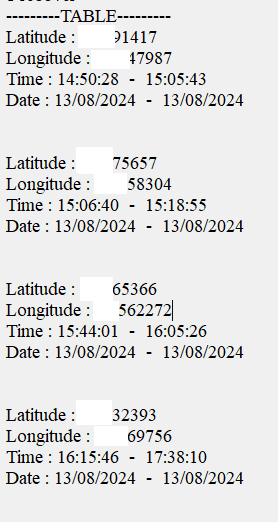
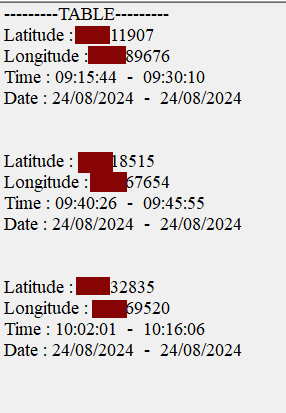
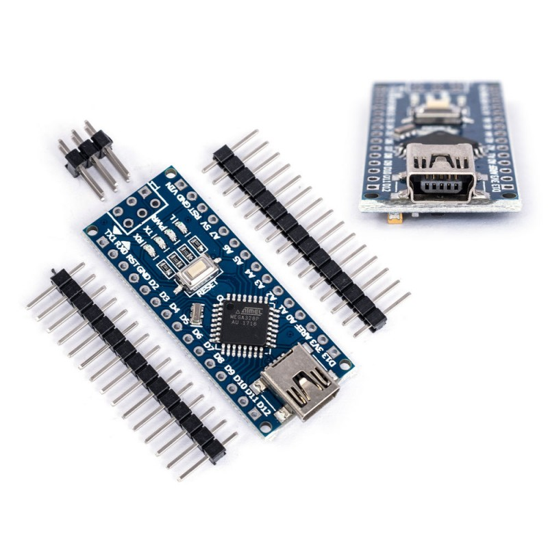
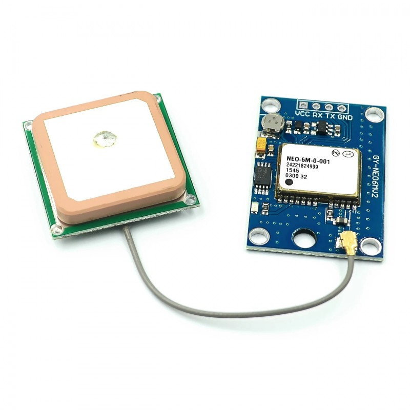
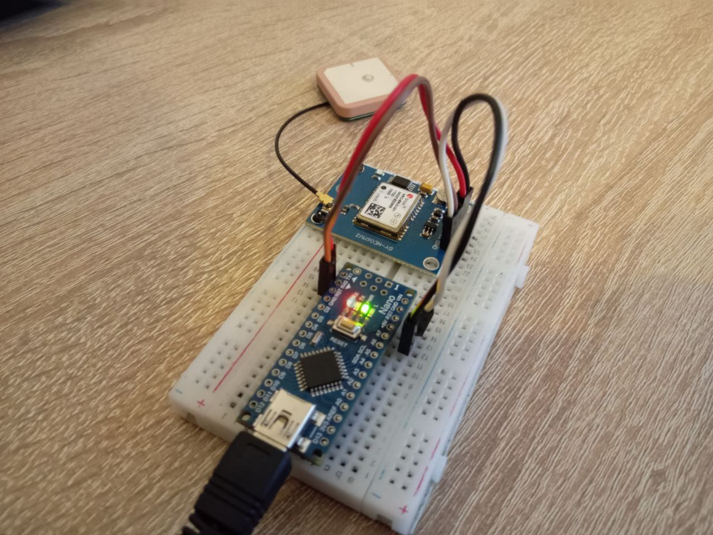
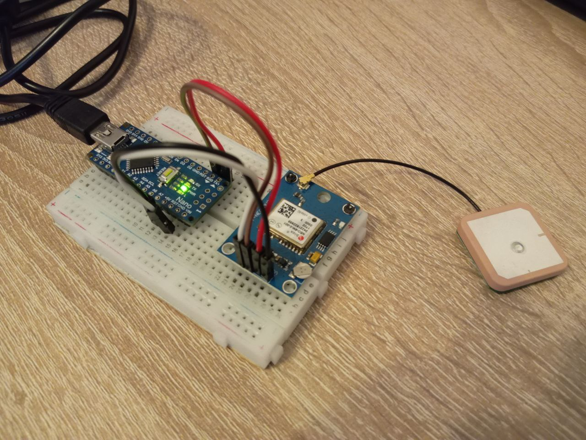
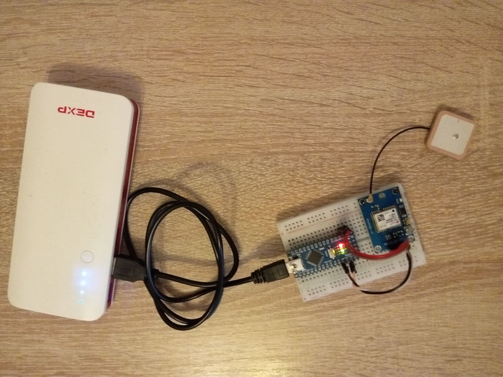

<h1 align="center" style="border-bottom: none">
	TimeYourself
</h1>

TimeYourself — это проект на микроконтроллере, который был создан, для помощи в организации времени.

В проекте была использована библиотека для парсинга строк, получаемых с модуля GPS: [TinyGPSPlus](https://github.com/mikalhart/TinyGPSPlus).

## Принцип работы

  Устройство собирает данные о местоположении и времени, в котором находиться.

  Таблица, хранящаяся в EEPROM, и позволяющая хранить до 20 записей ( 1024 байт EEPROM, каждая запись по 50 байт), фиксирует местоположение, начальное и конечное время, которое объект в нем провел (объектом может выступать человек, его машина и т.д.).

   
   

  Местоположение и начальное время считается важным для записи, в том случае если объект провел в нем более THRESHOLD_TIME времени (например, 5 минут). Местоположение считается покинутым (запись конечного времени пребывания в нем), если объект удалился от него на радиус более THRESHOLD_DIST (например, 50 метров).

  Данное устройство помогает зафиксировать количество времени пребываемое в разных местах и в последующем, зная эти затраты, человек может проанализировать и лучше организовать свое время.
  
## Состав компонентов
* Arduino Nano v3
  
  
  Плата на микроконтроллере ATmega328PB в данном проекте отвечает за обработку и анализ данных, поступающих с GPS модуля по UART. Также передает информацию, хранящуюся в EEPROM на терминал для просмотра. 
  - _Flash память: 32 Кб (2 Кб занято загрузчиком)_
  - _SRAM: 2 Кб_
  - _EEPROM: 1 Кб_
  - _Частота работы: 16 мГц_
 
* GPS-модуль NEO-6M
  

  Обмен данными происходит через UART на скорости 9600 бод на микроконтроллер в формате NMEA. Способен отслеживать до 22 спутников одновременно, для стабильного получения данных о местоположении и времени, с небольшой погрешностью, достаточно получать информацию от 4 спутников одновременно. Потребление тока составляет 45 мА. Уровень питания чипа 2.7-3.6 В.

## Соединение компонентов

  
  
  

  Питание обеспечивается протативным аккумулятором на 11000 мА*ч, что позволит проработать устройству около 4 дней без подзарядки. Возможно так же обеспечения питания с помощью батареек CR2032, однако тогда устройство будет работать меньшее количество времени.
      
## Обзор программной части

* [EEPROMhandler.h](EEPROMhandler.h).
  
  Модуль отвечает за запись и чтение EEPROM на микроконтроллеере.
  
  В данном микроконтроллере такой памяти доступно 1 Кб.

* [UARThandler.h](UARThandler.h).
  
  Модуль отвечает за запись и чтение UART на микроконтроллеере.

  - _Baud Rate : 9600_
  - _Data bits : 7_
  - _Parity : none_
  - _Stop Bits : 1_
 
* [RingBuf.h](RingBuf.h).
  
  Кольцевой буфер, для чтения и записи байтов в UART.

* [TinyGPS](https://github.com/GordonNotCole/TinyGps-submodule/tree/2fd546fe0d1f096c6bf9958c90d4f542e8abd066).
  
  Сторонняя библиотека для парсинга NMEA строки, получаемой с GPS модуля.

* [TimeYourself.ino](TimeYourself.ino).
  
  Основной модуль, реализующий сравнение и анализ времени и местоположений.
    
## Установка
Скомпилируйте этот проект в Arduino IDE, после чего с помощью программатора Usbasp загрузите на Arduino Nano v3.

